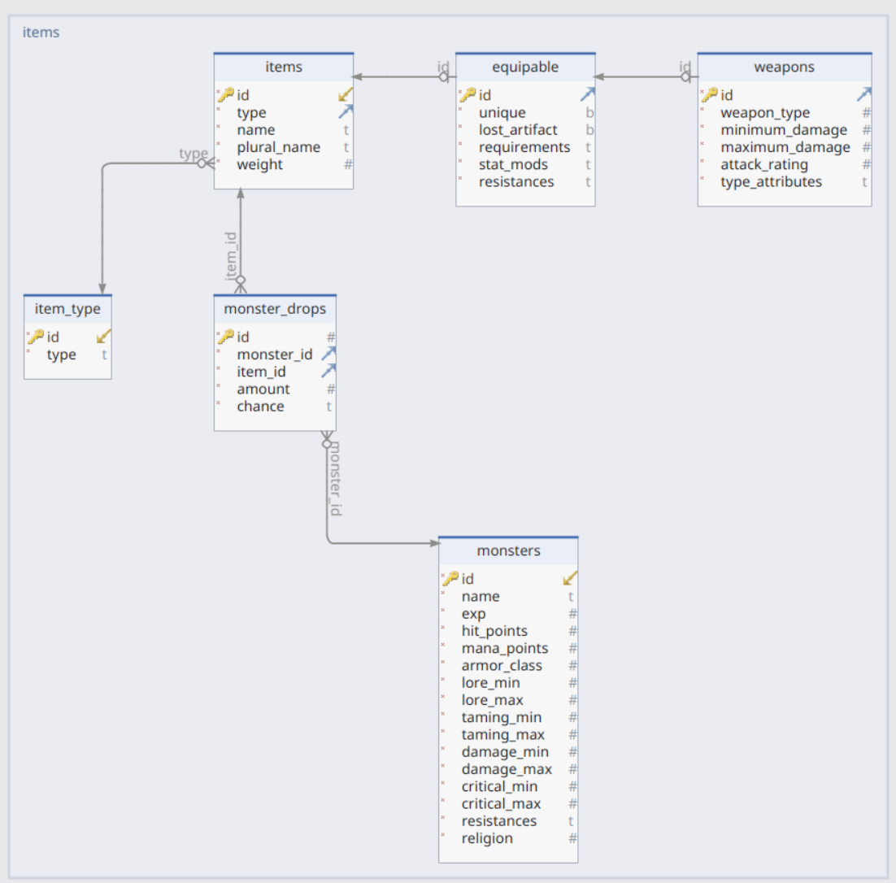

# Open Faldon 

This python script takes the objects.dat file used by Open Faldon and converts it to a SQLite database.

# objects.dat Reverse Engineering

If you're interested in how the objects.dat file is represented please see [my reverse engineering notes](objects-dat-notes.md).

# Setup

```
$ python3 -m venv .venv
$ source .venv/bin/activate
$ pip install -r requirements.txt
$ ./util/pull-objects-dat.sh
$ ./util/create-db.sh
```

# Browsing the DB

You can browse the DB with the [SQLite Online IDE](https://sqliteonline.com/).

## DB Schema



# Querying the DB

The DB contains scraped data from the Open Faldon objects.dat and the drops.txt supplied by Catbert on Discord.

This data is not well normalized and some items may be missing from the drop table due to parsing errors.

## Monsters

Resistances field is a JSON type see the [Equipables and Weapons](#equipables-and-weapons) section to see examples of filtering on a JSON field.

See all monster data.
```
SELECT 	*
	FROM monsters;
```


## Drops

See basic data about all drops.
```
SELECT 	m.id,
		m.name,
        m.hit_points,
        m.mana_points,
        m.exp,
        i.name,
		m_d.amount,
        m_d.chance  
    FROM monster_drops m_d inner join monsters m on m_d.monster_id = m.id Inner Join items i on m_d.item_id = i.id;
```

See all drop data.
```
SELECT 	*
    FROM monster_drops m_d inner join monsters m on m_d.monster_id = m.id Inner Join items i on m_d.item_id = i.id;
```

## Equipables and Weapons

All items are equipable but not all equipable items are weapons.

Select all equippable items.

```
SELECT 	i.id,
        i.type,
        i.name,
        i.weight,
        e.requirements,
        e.stat_mods,
        e.resistances,
        i_t.type
        FROM items i INNER JOIN item_type i_t ON i.type = i_t.id JOIN equipable e USING (id);
```

Select all weapons.
```
SELECT *
    FROM items i INNER JOIN item_type i_t ON i.type = i_t.id JOIN equipable e USING (id) where i.type = 1;
```

Stat requirements and resists are stored as JSON objects. They can be turned into rows to ease querying.
```
SELECT i.id,
		i.name,
        i.weight,
        e.resistances,
        i_t.type,
        json_extract(e.requirements, '$.str') AS str_req,
        json_extract(e.requirements, '$.def') AS def_req,
        json_extract(e.requirements, '$.con') AS con_req,
        json_extract(e.requirements, '$.int') AS int_req,
        json_extract(e.requirements, '$.stam') AS stam_req,
        json_extract(e.requirements, '$.mag') AS mag_req,
        json_extract(e.requirements, '$.level') AS level_req,
        json_extract(e.stat_mods, '$.str') AS str_mod,
        json_extract(e.stat_mods, '$.def') AS def_mod,
        json_extract(e.stat_mods, '$.con') AS con_mod,
        json_extract(e.stat_mods, '$.int') AS int_mod,
        json_extract(e.stat_mods, '$.stam') AS stam_mod,
        json_extract(e.stat_mods, '$.mag') AS mag_mod,
        json_extract(e.resistances, '$.lightning') AS lightning_res,
        json_extract(e.resistances, '$.fire') AS fire_res,
        json_extract(e.resistances, '$.poison') AS poison_res,
        json_extract(e.resistances, '$.holy') AS holy_res,
        json_extract(e.resistances, '$.magic') AS magic_res,
        json_extract(e.resistances, '$.paralysis') AS paralysis_res
        FROM items i INNER JOIN item_type i_t ON i.type = i_t.id JOIN equipable e USING (id);
```

### Querying Further

Take the above query and add a WHERE clause.

Ex: See items > 50 and < 100 that give >= 10% fire resistance.

```
        ...snip...
        json_extract(e.resistances, '$.poison') AS poison_res,
        json_extract(e.resistances, '$.holy') AS holy_res,
        json_extract(e.resistances, '$.magic') AS magic_res,
        json_extract(e.resistances, '$.paralysis') AS paralysis_res
        FROM items i INNER JOIN item_type i_t ON i.type = i_t.id JOIN equipable e USING (id)
        WHERE level_req >= 50 AND level_req < 100 AND fire_res >= 10;
```
